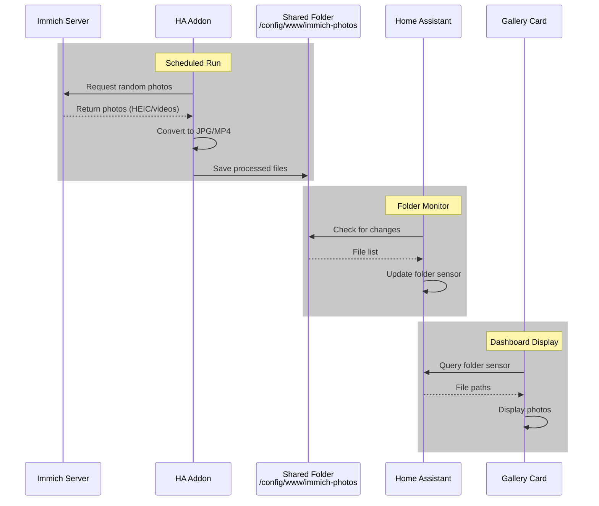

# hass-immich-addon
An addon for Home Assistant which retrieves photos using immich's API to be displayed on dashboards.

> This addon is a WIP and is not recommended for use until this banner is removed

## Setup

Home Assistant and this service will need to both access `HASS_IMG_PATH`.  

For HASS to monitor `HASS_IMG_PATH` you may use the [folder](https://www.home-assistant.io/integrations/folder/) integrration that is built in. It requires setup in `configuration.yaml`.

I used a folder sensor to provide the contents of what I am uploading:

```yaml
sensor:
  - platform: folder
    folder: /config/www/immich-album
```

Then a shell script to copy from one photo from the sensor to a fixed image displayed on the dashboard. I did this because there were no slideshow cards that updated lovelace when the images changed in the folder.

```yaml
shell_command:
  update_photo_frame: cp "{{ image_path }}" /config/www/photo-frame/photo_frame_image.jpg
```

I used the UI to add a `camera` entity for that image.

Integrations -> Local File

Name: Photo Frame Image
Path: `/config/www/photo-frame/photo_frame_image.jpg`

Which gives us camera.photo_frame_image

To tie all this jank together I added an automation that periodically read the contents of the directory and updated the displayed photo:

```yaml
alias: Cycle Photo Frame Image
description: ""
triggers:
  - seconds: /10
    trigger: time_pattern
conditions: []
actions:
  - target:
      entity_id: input_text.photo_frame_image
    data:
      value: >
         {% set
        idx = (now().timestamp() // 10) | int % files|length %} {{ files[idx] if
        files else '/config/www/immich-album/no-image.jpg' }}
    action: input_text.set_value
  - data:
      image_path: "{{ states('input_text.photo_frame_image') }}"
    action: shell_command.update_photo_frame
mode: single
```

And then you are free to do whatever with a self updating snapshot! I use a simple `picture-entity` card:

```yaml
show_state: false
show_name: false
camera_view: auto
fit_mode: cover
type: picture-entity
entity: camera.photo_frame_image
```

### Stuff that did not work

I tried the gallery-card first but it did not update.

```yaml
type: custom:gallery-card
entities:
  - sensor.immich_album
slideshow_timer: 7
menu_alignment: hidden
caption_format: " "
```

I tried to use `input_text` to change the path of a picture but that didn't pan out. 

```yaml
  - target:
      entity_id: input_text.photo_frame_image
    data:
      value: >
         {% set
        idx = (now().timestamp() // 10) | int % files|length %} {{ files[idx] if
        files else '/local/immich-album/no-image.jpg' }}
    action: input_text.set_value
```

Use the following from HACS:

* https://github.com/TarheelGrad1998/gallery-card
* https://www.home-assistant.io/integrations/folder/ 

Setup a directory this addon and

## Process




