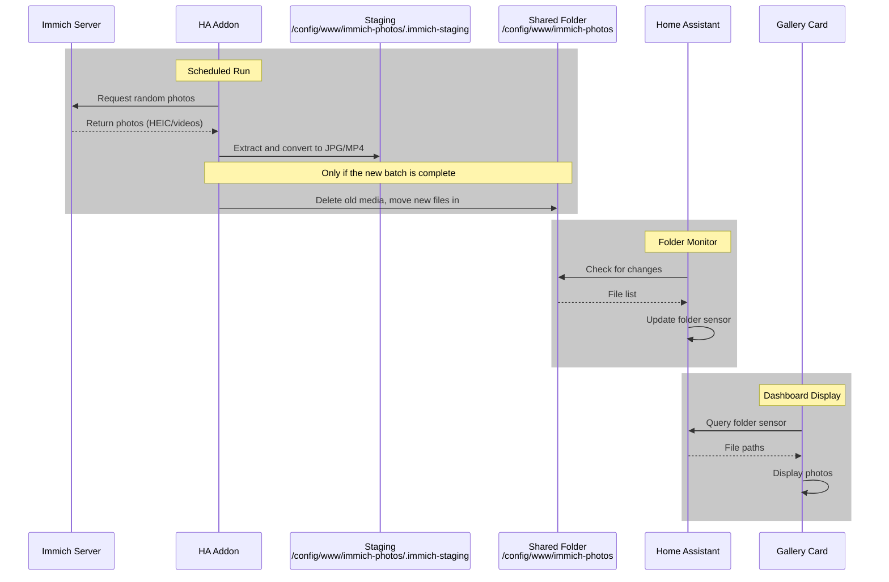

# hass-immich-addon
An addon for Home Assistant which retrieves photos using immich's API to be displayed on dashboards.

> This addon is a WIP and is not recommended for use until this banner is removed

## Setup

Home Assistant and this service will need to both access `HASS_IMG_PATH`.  

For HASS to monitor `HASS_IMG_PATH` you may use the [folder](https://www.home-assistant.io/integrations/folder/) integrration that is built in. It requires setup in `configuration.yaml`.

I used a folder sensor to provide the contents of what I am uploading:

```yaml
sensor:
  - platform: folder
    folder: /config/www/immich-album
```

Then a shell script to copy from one photo from the sensor to a fixed image displayed on the dashboard. I did this because there were no slideshow cards that updated lovelace when the images changed in the folder.

```yaml
shell_command:
  update_photo_frame: cp "{{ image_path }}" /config/www/photo-frame/photo_frame_image.jpg
```

I used the UI to add a `camera` entity for that image.

Integrations -> Local File

Name: Photo Frame Image
Path: `/config/www/photo-frame/photo_frame_image.jpg`

Which gives us camera.photo_frame_image

To tie all this jank together I added an automation that periodically read the contents of the directory and updated the displayed photo:

```yaml
alias: Cycle Photo Frame Image
description: ""
triggers:
  - seconds: /10
    trigger: time_pattern
conditions: []
actions:
  - target:
      entity_id: input_text.photo_frame_image
    data:
      value: >
         {% set
        idx = (now().timestamp() // 10) | int % files|length %} {{ files[idx] if
        files else '/config/www/immich-album/no-image.jpg' }}
    action: input_text.set_value
  - data:
      image_path: "{{ states('input_text.photo_frame_image') }}"
    action: shell_command.update_photo_frame
mode: single
```

And then you are free to do whatever with a self updating snapshot! I use a simple `picture-entity` card:

```yaml
show_state: false
show_name: false
camera_view: auto
fit_mode: cover
type: picture-entity
entity: camera.photo_frame_image
```

### Stuff that did not work

I tried the gallery-card first but it did not update.

```yaml
type: custom:gallery-card
entities:
  - sensor.immich_album
slideshow_timer: 7
menu_alignment: hidden
caption_format: " "
```

I tried to use `input_text` to change the path of a picture but that didn't pan out. 

```yaml
  - target:
      entity_id: input_text.photo_frame_image
    data:
      value: >
         {% set
        idx = (now().timestamp() // 10) | int % files|length %} {{ files[idx] if
        files else '/local/immich-album/no-image.jpg' }}
    action: input_text.set_value
```

Use the following from HACS:

* https://github.com/TarheelGrad1998/gallery-card
* https://www.home-assistant.io/integrations/folder/ 

Setup a directory this addon and

## Configuration

Settings come from `settings.yaml` (see the sample in this repo), environment variables, and command line flags, in increasing order of priority. Each entry under `filters` is a *filter set*; the addon cycles to the next one on every update.

### Date filters

`taken_after` and `taken_before` restrict a filter set to photos taken in a date range. Both accept a date, a full timestamp, or a timestamp with a timezone:

```yaml
filters:
  - name: "Wedding Photos"
    selector_type: "random"
    taken_before: "2013-01-01"            # date only
  - name: "That One Evening"
    selector_type: "random"
    taken_after: "2025-10-20T18:00:00"    # timezone-less: treated as UTC
    taken_before: "2025-10-20T23:59:59-04:00"  # explicit offset is used as given
```

**A value without a timezone is treated as UTC.** Immich validates these strictly (it rejects a timestamp with no `Z` and no offset with `400 Validation failed`), so the addon always qualifies the value before sending it: a timezone-less value goes out as UTC, and a value with an offset keeps that offset. If your library's timestamps are local and the boundary matters to you, write the offset out explicitly.

Unquoted values work too — YAML parses `taken_after: 2023-01-01` into a date and `2023-01-01 10:30:00` into a timestamp — and are treated the same way.

## Process

Every cycle fetches the new batch **before** touching the photos currently on display:

1. Ask Immich for the next batch of asset IDs using the current filter set.
2. Download, extract and convert (HEIC to JPG/MP4) into a hidden staging directory inside `HASS_IMG_PATH`.
3. Only once a complete, non-empty batch is staged: delete the old media files and move the new ones in. The moves are renames on the same filesystem, so the folder is only briefly incomplete.

If anything fails — Immich is down or restarting, a validation error, a bad archive — or if the filter set matched no photos, **the previous photos stay on display** and the reason is logged as a warning or error. The frame keeps showing the last good batch instead of going empty until the next successful cycle. The staging directory is hidden (its name starts with a `.`), so Home Assistant's folder sensor never picks up a half-downloaded photo, and it is removed at the end of every cycle — including one left behind by a run that was killed.


```mermaid
sequenceDiagram
    participant I as Immich Server
    participant A as HA Addon
    participant S as Staging<br>/config/www/immich-photos/.immich-staging
    participant F as Shared Folder<br>/config/www/immich-photos
    participant H as Home Assistant
    participant G as Gallery Card

    rect rgb(200, 200, 200)
        Note over A: Scheduled Run
        A->>I: Request random photos
        I-->>A: Return photos (HEIC/videos)
        A->>S: Extract and convert to JPG/MP4
        Note over A,F: Only if the new batch is complete
        A->>F: Delete old media, move new files in
    end

    rect rgb(200, 200, 200)
        Note over H: Folder Monitor
        H->>F: Check for changes
        F-->>H: File list
        H->>H: Update folder sensor
    end

    rect rgb(200, 200, 200)
        Note over G: Dashboard Display
        G->>H: Query folder sensor
        H-->>G: File paths
        G->>G: Display photos
    end
```


## Development

```bash
python -m venv .venv && source .venv/bin/activate
pip install -r requirements-dev.txt
python -m pytest -v
```

The tests mock the HTTP session; nothing talks to a real Immich server. CI runs them on every pull request and on pushes to `main`.
